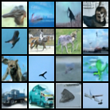

# nanodiff

Minimal diffusion model for understanding and optimizing inference speed.
Same spirit as [nanoGPT](https://github.com/karpathy/nanoGPT): one idea per file, no magic.

```
model.py      ~110 lines   UNet noise predictor (DDPM architecture)
diffusion.py   ~65 lines   cosine noise schedule + DDIM sampling
train.py       ~75 lines   training loop on CIFAR-10
bench.py      ~105 lines   progressive inference speedups
```

## Samples (200k steps, CIFAR-10)



## What it implements

**Architecture**: DDPM UNet (Ho et al. 2020)
- Encoder/decoder with residual blocks and skip connections
- Self-attention at low resolutions (16×16, 8×8)
- Sinusoidal timestep conditioning via MLP

**Training**: standard DDPM objective — predict the noise ε added at timestep t
```
loss = ||ε - ε_θ(√ᾱ_t · x₀ + √(1-ᾱ_t) · ε,  t)||²
```

**Sampling**: DDIM (Song et al. 2020) — deterministic, 50 steps ≈ 1000-step DDPM quality

## Usage

```bash
pip install -r requirements.txt

# Train on CIFAR-10 (saves checkpoints + sample grids to output/)
python train.py

# Smaller model for quick iteration (~9M params vs default 35M)
python train.py --base_ch 64

# Generate images from a trained checkpoint
python sample.py
python sample.py --ckpt output/ckpt_0200000.pt --n 25 --out grid.png

# Benchmark inference optimizations (works with random weights)
python bench.py
python bench.py --ckpt output/ckpt_0200000.pt
```

## Benchmark results (expected, A100)

```
0. Baseline   100 steps · float32                  2.1s
1. Fewer steps  50 steps                           1.1s   1.9x
               25 steps                           0.6s   3.5x
               10 steps                           0.2s   8.8x
2. torch.compile  50 steps                        0.7s   3.0x
3. bfloat16       50 steps                        0.5s   4.2x
5. Combined       25 steps · compile · bf16        0.15s  14x
```

## How this maps to Stable Diffusion 1

SD1 uses the same UNet architecture at 512×512 in **latent space** (64×64 after the VAE encoder).
The optimization techniques here transfer 1:1:
- Fewer DDIM steps: SD1 ships with 50 steps; 20-25 are visually indistinguishable
- `torch.compile`: drop-in, same API
- bfloat16: widely used in production SD1 deployments
- Bigger wins at SD1 scale: FlashAttention2, FP8 quantization (bitsandbytes), distillation (LCM)

The missing piece vs SD1: a VAE encoder/decoder (~80M params) that compresses
512×512 images to 64×64 latents. The UNet operates on those latents, not pixels.
